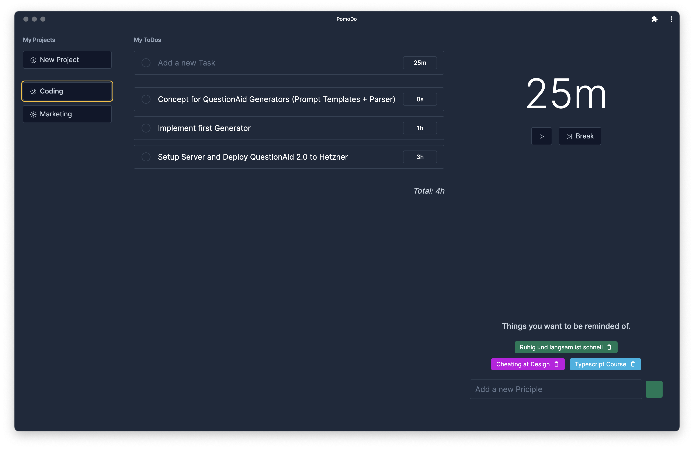

<p align="center">
  <h1 align="center">Focus HQ</h1>

  <p align="center">
    Suite of tools for anyone who wants to stay more structured and get more done!
  </p>

<p align="center">
  
  </p>
</p>

<br/>

## About FocusHQ
First of all - a great thanks to github user <b>maltesa</b> who I forked the repo from. I definitely saved a lot of hours by continuing on his work instead of doing it from scratch.

The backstory is that I started on a Pomodoro & ToDo-list app and launched it in december of 2021. It was a bit buggy and I was very new to react, redux and typescript in general so I stopped using it, but it was a great learning experience.
So now I'll be putting in a few weekends again, but with a different starting point.


### Features

- Pomodoro Timer
- Codingweek / Marketingweek Reminder
- Todolist

### Todo List
- [ ] Option to choose sounds
- [ ] Allow to notify even when tab not in focus
- [ ] New modal for creating a new project
- [ ] Possibility to delete projects
- [ ] Maintain state between sessions (accidental exits etc.)

### Built With

- [Typescript](https://www.typescriptlang.org/)
- [Vite](https://vitejs.dev/)
- [React](https://reactjs.org/)
- [TailwindCSS](https://tailwindcss.com/)
- [Dexie.js](https://dexie.org/)

## Getting started

To get the project running locally on your machine you need to have the following development tools installed:

- Node.JS (we recommend v16) 
  - Install by using `nvm install 16.0.0`
- Yarn

1. Clone the project:

```
git clone git@github.com:atopheim/focushq.git && cd focushq
```

2. Install Node.JS packages via yarn. Don't have yarn? Use `npm install --global yarn`.

```
yarn install
```

3. Start the development server:

```
yarn dev
```

**You can now access the app on [https://localhost:5173](https://localhost:5173)**.

## Contributing

Contributions are what make the open source community such an amazing place to be learn, inspire, and create. Any contributions you make are **greatly appreciated**.

1. Fork the project
2. Create your feature branch (`git checkout -b feature/AmazingFeature`)
3. Make your changes
4. Commit your changes (`git commit -m 'Add some AmazingFeature'`)
5. Push to the branch (`git push origin feature/AmazingFeature`)
6. Open a pull request
